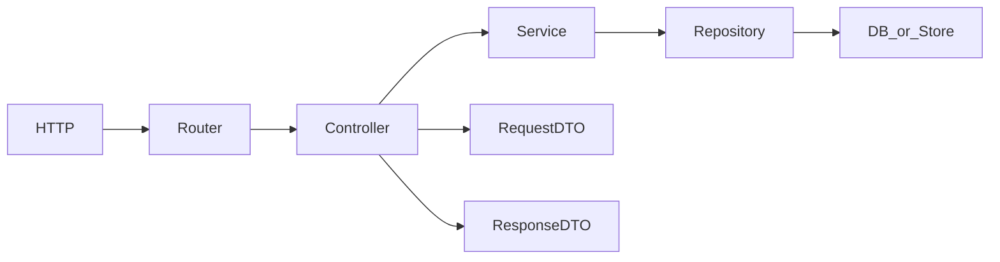

# New API scaffolding (layout reference)

This guide describes how a **new HTTP API resource** is laid out in FastMVC so you can implement a **code generator or CLI** that asks for inputs once and emits a consistent tree. It reflects the **sample Item API** (`/items`) after migration out of a dedicated `example/` package: the same patterns apply to any resource (e.g. `product`, `order`).

## Concepts

| Concept | Meaning |
|--------|---------|
| **API version** | Usually `v1`, reflected under `controllers/apis/v1/`, `dependencies/services/v1/`, and optionally `dtos/requests/apis/v1/`. |
| **Segment / area** | A folder name for a feature slice (`user`, `item`, `example` for DTO demos). |
| **Resource slug** | Plural route prefix (e.g. `items`) and singular PascalCase names (`Item`, `ItemEntity`). |
| **Operation** | For small APIs, one controller file may hold all routes; for larger APIs, split by verb (`create.py`, `fetch.py`) like `controllers/auth/fetch.py`. |

### Leaf file naming (nested folders)

When a module already lives under a **segment path** (e.g. `dtos/requests/item/`), **do not repeat** the segment or resource in the **filename**. The folder supplies context; the file should use a **short verb or role** name.

| Path | Preferred leaf file | Avoid |
|------|---------------------|--------|
| `dtos/requests/<segment>/` | `create.py`, `update.py`, `patch.py` | `create_<segment>_request_dto.py` |
| `dtos/responses/<segment>/` | Prefer short names where unambiguous (e.g. `item_response_dto.py` may stay until refactored to `response.py` / `list.py`) | Long redundant prefixes |

**Class names** inside the module stay **fully explicit** (e.g. `CreateItemRequestDTO` in `create.py`). Generators and humans import via `dtos.requests.item` or `from dtos.requests.item.create import CreateItemRequestDTO`.

### One concrete class per file (DTOs)

| Rule | Detail |
|------|--------|
| **Default** | **One** concrete Pydantic model **class** per **module** (`.py` file), **one purpose** (e.g. create vs update vs delete each get their own file). |
| **Nested models** | Helper models that **only** support a parent DTO (e.g. a nested `LineItem` inside `CreateOrderRequestDTO`) **may** live **in the same file** as that parent. If a nested type is **reused** elsewhere, move it to its own module (e.g. `line_item.py`). |
| **Abstractions** | Shared bases (`IRequestExampleDTO`, segment `abstraction.py`) are **not** “concrete” DTOs; keep **one abstraction module per segment** when practical. |

CLI and codegen should emit **`create.py`**, **`update.py`**, **`delete.py`** (etc.) under `dtos/requests/<segment>/`, each exporting a **single** primary class, unless the template explicitly groups nested types with their parent.

## End-to-end flow



- **Router**: `APIRouter` with `prefix` and `tags`.
- **Controller**: `IController` subclass; validates/coerces, calls **service**, maps to **response DTOs**.
- **Service**: `IService` / `I*Service` subclass; business rules; calls **repository**.
- **Repository**: `IRepository` / `I*Repository` subclass; persistence.
- **Entity** (optional): domain model under `entities/<segment>/`.
- **DTOs**: request bodies under `dtos/requests/...`, responses under `dtos/responses/...`.

## Directory checklist (generator output)

Use **`<segment>`** (e.g. `item`, `product`) and **`<Ver>`** (e.g. `v1`). Paths are relative to the application package root (e.g. `fast_mvc/`).

### 1. Domain entity (optional but typical)

```
entities/
└── <segment>/
    ├── __init__.py
    └── item_entity.py            # or short leaf e.g. entity.py if one entity per segment
```

- Inherit from `abstractions.entity.Entity` (or `IEntity`).
- Keep validation and `to_dict` / `from_dict` here.
- If the segment folder contains **only one** entity, a **short** leaf name (`entity.py`) is acceptable; otherwise use a disambiguating name (`item_entity.py`).

### 2. DTOs

```
dtos/
├── requests/
│   └── <segment>/                # or requests/apis/<Ver>/<segment>/ for versioned APIs
│       ├── __init__.py
│       ├── create.py             # classes e.g. CreateProductRequestDTO (short leaf name)
│       └── update.py
└── responses/
    └── <segment>/
        ├── __init__.py
        ├── item_response_dto.py  # legacy naming; prefer response.py / list.py when refactored
        ├── item_list_response_dto.py
        └── item_stats_response_dto.py   # if needed
```

- Request DTOs inherit from `dtos.requests.abstraction.IRequestDTO` (or layered `IRequest*DTO`).
- Response DTOs often compose `dtos.responses.I.IResponseDTO` patterns used in your app.
- **Leaf naming**: see [Leaf file naming](#leaf-file-naming-nested-folders) above — verbs in the filename, full names on classes.

### 3. Repository

```
repositories/
└── <segment>/
    ├── __init__.py
    ├── abstraction.py            # class I<Segment>Repository(IRepository)
    └── <segment>_repository.py   # concrete implementation
```

### 4. Service

```
services/
└── <segment>/
    ├── __init__.py
    ├── abstraction.py            # class I<Segment>Service(IService)
    └── <segment>_service.py
```

- Implement `run()` if you use generic service dispatch; otherwise expose explicit methods (`create_item`, …) as in the Item sample.

### 5. Dependencies (FastAPI `Depends`)

```
dependencies/
├── repositories/
│   └── <segment>/
│       ├── __init__.py
│       └── <segment>_repository_dependency.py   # class *RepositoryDependency(IRepositoryDependency)
└── services/
    └── <Ver>/
        └── <segment>/
            ├── __init__.py
            ├── abstraction.py                     # I<Segment>ServiceDependency(IV1ServiceDependency)
            └── <segment>_service_dependency.py    # class *ServiceDependency
```

- Each class exposes `derive(request: Request, ...)` (and nested `Depends` for repository → service chains).
- Re-export from `dependencies/repositories/__init__.py` when you want a stable public surface.

### 6. Controller + router

```
controllers/
└── apis/
    └── <Ver>/
        └── <segment>/
            ├── __init__.py         # export router, controller class
            ├── abstraction.py    # optional I<Segment>APIController(IAPIV1Controller)
            └── <segment>_controller.py   # APIRouter + handler class, or split create/fetch per operation
```

- Register routes on an `APIRouter(prefix="/<resources>", tags=["<resources>"])`.
- Static paths (`/search`, `/statistics`) **before** `/{id}` routes to avoid path conflicts.

### 7. Application wiring

- **`app.py`**: `app.include_router(<Router>, ...)` for the new router (optional try/except for optional features).
- **`apis/__init__.py`** (if used): nest under main API router.
- **Package `__init__.py`**: optional re-exports for `from fast_mvc import ...`.

### 8. Factories (tests / local tooling)

```
factories/
└── apis/
    └── <Ver>/
        └── <segment>/
            ├── __init__.py
            ├── common.py
            ├── fetch.py
            ├── create.py
            └── ...
```

- Mirror DTO packages; builders return `dict` or `.build_dto()` for pytest.

### 9. Test support (pytest)

```
testing/
└── <segment>/
    ├── __init__.py
    ├── factories.py              # ItemFactory-style builders
    └── fixtures.py               # item_client, test_item, …
```

- **`tests/conftest.py`** may import fixtures from `testing.<segment>.fixtures`.

### 10. Tests (mirror production tree)

```
tests/
├── controllers/apis/<Ver>/<segment>/   # HTTP tests
├── services/<segment>/
├── repositories/<segment>/
└── factories/apis/<Ver>/<segment>/
```

## CLI questionnaire (suggested prompts)

Your generator should collect at least:

| Prompt | Used for |
|--------|----------|
| Resource name (singular, PascalCase) | Class names: `Product`, `ProductEntity` |
| Resource name (plural, snake_case) | Module segments, table prefixes: `products` |
| API version string | `v1` → folder `apis/v1/` |
| URL prefix (no leading slash) | `products` → `APIRouter(prefix="/products")` |
| OpenAPI tags | Usually same as plural resource |
| Operations list | `create`, `read`, `update`, `delete`, `list`, custom actions |
| Use entity layer? | If yes, generate `entities/<segment>/` |
| Persistence style | `memory`, `sqlalchemy`, `stub` — affects repository template |
| Auth required? | Wire `Depends` / middleware flags in router |

## Files the CLI should emit (minimum viable)

For a CRUD resource similar to **Item**, emit roughly:

1. `entities/<segment>/<entity>.py`
2. `dtos/requests/<segment>/create.py`, `update.py`, … (+ `__init__.py`) — short leaf names; see [Leaf file naming](#leaf-file-naming-nested-folders)
3. `dtos/responses/<segment>/` (+ `__init__.py`) — response modules (naming as per segment conventions)
4. `repositories/<segment>/abstraction.py`, `<segment>_repository.py`, `__init__.py`
5. `services/<segment>/abstraction.py`, `<segment>_service.py`, `__init__.py`
6. `dependencies/repositories/<segment>/<segment>_repository_dependency.py`, `__init__.py`
7. `dependencies/services/<Ver>/<segment>/abstraction.py`, `<segment>_service_dependency.py`, `__init__.py`
8. `controllers/apis/<Ver>/<segment>/<segment>_controller.py`, `__init__.py`
9. `testing/<segment>/factories.py`, `fixtures.py`, `__init__.py`
10. **Patch** `app.py` (include router) and optionally root `__init__.py`
11. One test module under `tests/...` mirroring the controller path

## Conventions to preserve

- **One primary class per file** for dependencies and services where possible.
- **Class-based DI**: `SomeDependency.derive` instead of loose module functions (see `dependencies/services/v1/user/fetch.py` and `dependencies/services/v1/item/`).
- **Layered abstractions**: `I*Repository` / `I*Service` / `I*APIController` under each segment.
- **Imports**: prefer explicit package paths (`from entities.item.item_entity import ItemEntity`) over deep star imports.
- **Nested leaf paths**: short **module** filenames (`create.py`, `update.py`); **explicit** **class** names (`CreateItemRequestDTO`). See [Leaf file naming](#leaf-file-naming-nested-folders).
- **One concrete DTO class per file** (nested Pydantic helpers may share a file with their parent). See [One concrete class per file](#one-concrete-class-per-file-dtos).

## Reference implementation in this repo

- **Item CRUD**: `controllers/apis/v1/item/item_controller.py`, `services/item/`, `repositories/item/`, `entities/item/`, `dtos/requests/item/`, `dtos/responses/item/`, `testing/item/`.
- **Minimal “example” DTO flow** (separate from Item): `controllers/apis/v1/example/create.py`, `dtos/requests/example/` (`create.py`, `update.py`, `delete.py`, `abstraction.py`), `services/example/`, `repositories/example/`.

Use Item as the **full-stack** template; use `example` as a **thin** DTO + service + repository demo if you need a smaller generated footprint.

## Related

- [Project structure](project-structure.md)
- [Testing](testing.md)
- `dependencies/README.md`, `controllers/README.md`, `repositories/README.md`, `services/README.md`
